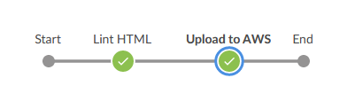

# Jenkins Pipelines on AWS

A simple Jenkins pipeline that lints and deploys a static website to an AWS S3 bucket as specified by [Udacity](https://www,udacity.com) for Cloud DevOps Engineer - project 4. 

## Specifications

Specifications as per Udacity course requirements can be found [here](./documentation/project_specifications.md).

## Pipeline

## Prerequisites

-  Latest Jenkins available, “tidy” linter.
-  AWS Account, IAM username and password, EC2 Key pair
-  A personal GitHub repository/account

## Instructions

This is project is more of a tutorial to follow not a downloadable / usable solution. To recreate the project follow the Udacity project instructions found [here](./documentation/project_specifications.md). Use provided Jenkinsfile as a reference if you have issues. 

***In the Repo***

***Jenkinsfile*** - The main Jenkinsfile for this pipeline

***index.html*** - The static website file

***README.md*** - This document  

***/documentation*** - Additional documents

***/submission*** - Files submitted for Udacity course requirements not needed to follow this project.
